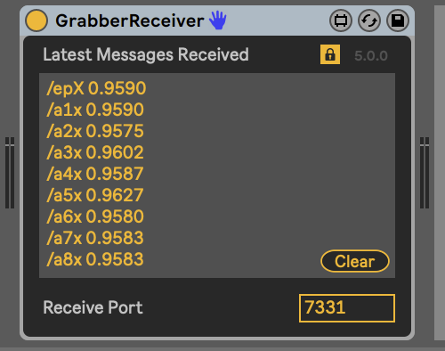

#Flowfield- music
### Requirements  
- Ableton Live 10 with Max for Live
- Max MSP
- Node.js
- Virtual MIDI ports. If you are using Windows and don't have a MIDI port software yet, you can download the following [loopMIDI](https://www.tobias-erichsen.de/software/loopmidi.html)
- Ableton Packs
	- [Solid Sounds](https://www.ableton.com/en/packs/solid-sounds/) 
	- [Electric Keyboards](https://www.ableton.com/en/packs/electric-keyboards/)
	- [LiveGrabber](https://www.showsync.com/tools)  
	 
###Set up
**Ableton Live 10** 

1. In Live > Preferences > Link Midi, make sure to select the MIDI port you are using under MIDI ports and Track should be on (I am using Max for Live "from Max 1" port)     
2. Download Solid Sounds and Electric Keyboards from the links above. Install the Ableton Packs by going to 'File > Install Pack...'. 

3. To install LiveGrabber, go to the Ableton File browser then 'Add Folder...'.  

**Max for Live**  
- In the Flow-field music folder, there are four Max for live patches: **receiveOSC.amxd, VolumeUp.amxd, VolumeDown.amxd and ssynth.amxd**. These patches need to be installed in the folder allocated to Max for Live devices in order for them to work

- Mac users: Copy files in Max Audio Effect folder, located in /Users/username/Music/Ableton/User Library/Presets/Audio Effects/Max Audio Effect
- Windows users: Follow step 3 - Add the "Flowfield-Music" project folder.
  
---

***

##Project

We started from a Max patch called [The Crowd](https://cycling74.com/tutorials/node-recipe-02-the-crowd) that uses node.js for Max MSP. Crowd uses an agent simulation library to generate complex behaviour. 
We are using the agents and epicenter location to control sounds. We are sending the epicentre x and y positions, agents' x and y positions and the "togertherness vs solitude" values of the agents to Live Ableton as midi notes and OSC values.  
The crowd simulation patch has a parameter that measures how close or far apart the agents are to each other depending on their position. We are interested in those values to send to Ableton Live to control the notes on the different midi tracks. 

***

###Max MSP

Send midi notes  
--
  
The information of each agent is send to different channels. In Live Ableton, each midi track receives data from the different channels.  

  

In step 5 of the max patch is where we select the midi port that is going to be used to send midi info and Live Ableton will receive it. 

  

Send OSC values
--
We are using Max object udpsend to send OSC values to Live based on the agents' positions

***

###Ableton Live 10

In Live, we have 8 tracks receiving midi notes from each of the agents and in **Experiment 1** we are using the parameters Grabber Receiver and ParamGrabber from Live grabber to receive the OSC values and control different live Parameters  
Receive MIDI notes. In **Experiment 2** we created Max for Live objects to receive OSC values.  

--
Choose the port you are receiving MIDI notes from for each track on Live and make sure that track 1 receives data from Channel 1, track 2 from Channel 2 and so on.  

---
-----

###Experiment 1  
Receive OSC values
--
  
  
---
-----

###Experiment 2  
Receive OSC values
--
We created a MAX patch within the Live environment called **receiveOSC** that receives the OSC values via updreceive. 
 
We get all OSC values through **udpreceive** and we were having some issues trying to unpack the values so decided to leave this method on the side and use Live Grabber.  

We still created two Max patch that receives the OSC values and controls the volume of the track the patch is on.   In this project, we are suing the patches **VolumeDown** and **VolumeUp** in tracks 3, 4, 5, 6, 7

####Volume Down
  

####Volume Up
  

